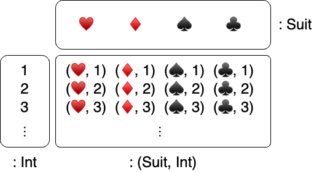
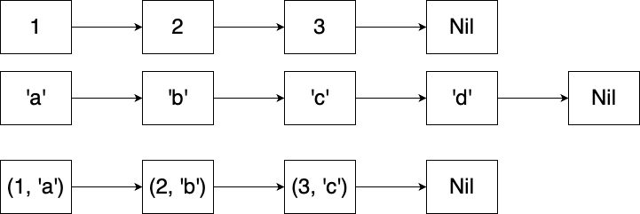

---
<!-- MoonBit Course © 2024 by DII, International Digital Economy Academy is licensed under Attribution-NonCommercial-NoDerivatives 4.0 International -->
marp: true
math: mathjax
paginate: true
backgroundImage: url('../pics/background_moonbit.webp')
headingDivider: 1
---

# 现代编程思想

## 多元组，结构体与枚举类型

### Hongbo Zhang

# 基础数据类型：多元组与结构体

# 回顾：多元组

- 多元组：**固定**长度的**不同**类型数据的集合
    - 定义：`(<表达式>, <表达式>, ...)`
    - 类型：`(<表达式类型>, <表达式类型>, ...)`
    - 例如：
        - 身份信息：`("Bob", 2023, 10, 24): (String, Int, Int, Int)`
    - 成员访问：
        - `<多元组>.<索引>`：`(2023, 10, 24).0 == 2023`
- 列表：**任意**长度的**相同**类型数据的集合
    - 例如：
        - 字符的序列：`Cons('H', Cons('i', Cons('!', Nil)))`
        - `Cons`：`construct`的缩写

# 笛卡尔积

- 一个多元组类型的元素即是每个组成类型的元素构成的有序元素组
    - 集合的笛卡尔积，又称积类型
    - 例：扑克牌的所有花色：{ ♥️ ♦️ ♠️ ♣️ } $\times \{ n \in \mathbb{N} | 1 \leq n \leq 52 \}$ 



# 结构体

- 元组的问题在于，难以理解其所代表的数据
    - `(String, Int)`：一个人的姓名和年龄？姓名和手机号？地址和邮编？
- 结构体允许我们赋予**名称**
    - `struct PersonalInfo { name: String; age: Int }`
    - `struct ContactInfo { name: String; telephone: Int }`
    - `struct AddressInfo { address: String; postal: Int }`
    通过名称，我们能明确数据的信息以及对应字段的含义

# 结构体的定义

- 结构体的定义形如`struct <结构体名称> { <字段名>: <类型> ; ... }`
    - `struct PersonalInfo { name: String; age: Int}`
- 定义结构体的值时，形如`{ <字段名>: <值> , ... }`
    - `let info: PersonalInfo = { name: "Moonbit", age: 1, }`
    - 结构体的值的定义不在意顺序：`{ age: 1, name: "Moonbit", }`
- 如遇到字段名相同的定义无法区分时，可在后面加上类型声明以作区分
    - `struct A { val: Int }`
    - `struct B { val: Int }`
    - `let x = ( { val : 1, } : A )`

# 结构体的访问与更新

- 访问结构体时，我们通过`<结构体>.<字段名>`
```moonbit
let old_info: PersonalInfo = { name: "Moonbit", age: 1, }
let a: Int = old_info.age // 1
```
- 更新原有的结构体时，我们可以复用原有的部分，如
```moonbit
let new_info = { .. old_info, age: 2, }
let other_info = { .. old_info, name: "Hello", }
```

# 多元组与结构体的关系

- 结构体与相同类型集合构成的多元组**同构**
    - 集合`A`与`B`之间存在一一映射的关系
    - 存在一对映射`f: (A) -> B`与`g: (B) -> A`使得
        - `g(f(a)) == a`
        - `f(g(b)) == b`
- 例：`struct PersonalInfo { name: String; age: Int }`与`(String, Int)`同构

```moonbit
fn f(info: PersonalInfo) -> (String, Int) { (info.name, info.age) }
fn g(pair: (String, Int)) -> PersonalInfo { { name: pair.0, age: pair.1, }}
```


# 多元组与结构体的关系

- 多元组是structural：只要结构相同（字段类型一一对应）就类型兼容
```moonbit
fn accept(tuple: (Int, String)) -> Bool {
  true
}
let accepted: Bool = accept((1, "Yes"))
```

- 结构体是nominal：只有类型名相同（字段顺序可以打乱）才类型兼容
```moonbit
struct A { val : Int ; other: Int }
struct B { val : Int ; other: Int }
fn accept(a: A) -> Bool {
  true
}
let not_accepted: Bool = accept(({ val : 1, other : 2 }: B)) // DO NOT COMPILE
let accepted: Bool = accept(({other: 2, val: 1}: A))
```

# 模式匹配

- 回顾：我们可以通过模式匹配查看列表和Option的结构

```moonbit
fn head_opt(list: List[Int]) -> Option[Int] {
  match list {
    Nil => None
    Cons(head, tail) => Some(head)
  }
}
```

```moonbit
fn get_or_else(option_int: Option[Int], default: Int) -> Int {
  match option_int {
    None => default
    Some(value) => value
  }
}
```

# 模式匹配

- 模式匹配可以匹配值（逻辑值、数字、字符、字符串）或者构造器
```moonbit
fn is_zero(i: Int) -> Bool {
  match i {
    0 => true
    1 | 2 | 3 => false
    _ => false
  }
}
```
    
- 构造器中可以嵌套模式进行匹配，或定义标识符绑定对应结构

```moonbit
fn contains_zero(l: List[Int]) -> Bool {
  match l {
    Nil => false
    Cons(0, _) => true
    Cons(_, tl) => contains_zero(tl)
  }
}
```

# 多元组和结构体的模式匹配

- 多元组模式匹配需数量一一对应
```moonbit
fn first(pair: (Int, Int)) -> Int {
  match pair {
    (first, second) => first
  }
}
```

- 结构体模式匹配可以匹配部分字段；可以不用另外命名标识符
```moonbit
fn baby_name(info: PersonalInfo) -> Option[String] {
  match info {
    { age: 0, .. } => None
    { name, age } => Some(name)
  }
}
```

# 缝合列表

我们试图缝合两个列表，生成一个数字与字符的二元组的列表，以最短者为准

```moonbit
fn zip(l1: List[Int], l2: List[Char]) -> List[(Int ,Char)] {
  match (l1, l2) {
    (Cons(hd, tl), Cons(hd2, tl2)) => Cons((hd, hd2), zip(tl, tl2))
    _ => Nil
  }
}
```



# 缝合列表

需要注意到模式匹配的顺序是从上到下的

```moonbit
fn zip(l1: List[Int], l2: List[Char]) -> List[(Int ,Char)] {
  match (l1, l2) {
    _ => Nil
    // 编辑器会提示未使用的模式及无法抵达的代码
    (Cons(hd, tl), Cons(hd2, tl2)) => Cons((hd, hd2), zip(tl, tl2))
  }
}
```

# 本地定义中的匹配

我们还可以在**本地**定义中利用模式进行匹配

- `let <模式> = <表达式>`

此时会根据模式将表达式的值的子结构绑定到定义的标识符上，如：

- `let (first, second) = (1, 2) // first == 1, second == 2`
- `let Cons(1, x) = List::Cons(1, Nil) // x == Nil`
- `let Cons(2, x) = List::Cons(1, Nil) // 运行时错误，程序中止`

# 枚举类型

# 不同情况的并集

- 如何定义周一到周日的集合？
- 如何定义硬币落下结果的集合？
- 如何定义表示整数四则运算的结果的集合？
- ...

# 枚举类型

为了表示不同情况的数据结构，我们使用枚举类型

```moonbit
enum DaysOfWeek {
  Monday; Tuesday; Wednesday; Thursday; Friday; Saturday; Sunday
}
```
  
```moonbit
enum Coin {
  Head
  Tail
}
```

# 枚举类型的定义与构造

```moonbit
enum DaysOfWeek {
  Monday; Tuesday; Wednesday; Thursday; Friday; Saturday; Sunday
}
```

- 每一种可能的情况即是构造器
```moonbit
let monday: DaysOfWeek = Monday
let tuesday: DaysOfWeek = Tuesday 
```

- 枚举类型定义可能重复，需要加上`<类型>::`加以区分

```moonbit
enum Repeat1 { A; B }
enum Repeat2 { A; B }
let x: Repeat1 = Repeat1::A  
```

# 枚举类型的意义

- 对比一下两个函数，枚举类型可以与现有类型区分开，更好地实现抽象
```moonbit
fn tomorrow(today: Int) -> Int
fn tomorrow(today: DaysOfWeek) -> DaysOfWeek
let tuesday = 1 * 2 // 这是周二吗？
```
- 禁止不合理数据的表示
```moonbit
struct UserId { email: Option[String]; telephone: Option[Int] }
enum UserId {
  Email(String)
  Telephone(Int)
}
```

# 枚举类型

- 枚举类型的每一种情况也可以承载数据，如

```moonbit
enum Option[T] {
    Some(T)
    None
}
```

```moonbit
enum ComputeResult {
    Success(Int)
    Overflow
    DivideByZero
}
```

- 此时枚举类型对应可区分的并集，又称和类型
  - $\textit{Option}(T) = \textit{Some}(T) \sqcup \{ \textit{None} \}$

# 代数数据类型

# 代数数据类型

我们将多元组、结构体、枚举类型等称为代数数据类型，它们具有代数结构
- 类型相等：同构
- 类型相乘：积类型
- 类型相加：和类型
- 加法的单位元：`enum Nothing {}`
- 乘法的单位元：`(): Unit`

# 代数数据类型

- $1 \times n = n$
    - 对于任意类型`T`，`(T, Unit)`与`T`同构
    ```moonbit
    fn f[T](t: T) -> (T, Unit) { (t, ()) }
    fn g[T](pair: (T, Unit)) -> T { pair.0 }
    ```
- $0 + n = n$
    - 对于任意类型`T`，`enum PlusZero[T] { CaseT(T); CaseZero(Nothing) }`与`T`同构
    ```moonbit
    fn f[T](t: PlusZero) -> T {
      match t {
        CaseT(t) => t
        CaseZero(_) => abort("对应集合为空，即不存在这样的值")
      }
    }

    fn g[T](t: T) -> PlusZero { CaseT(t) }
    ```

# 代数数据类型

- `enum Coins { Head; Tail }`
  - $\texttt{Coins} = 1 + 1 = 2$
- `enum DaysOfWeek { Monday; Tuesday; ...; }`
  - $\texttt{DaysOfWeek} = 1 + 1 + 1 + 1 + 1 + 1 + 1 = 7$
- `List`的定义（以`List[Int]`为例）：
$$
\begin{array}{r@{}l}
\texttt{enum} \;\; \texttt{List} & = \texttt{Nil} + \texttt{Int} \times \texttt{List} \\  
& = \texttt{1} + \texttt{Int} \times \texttt{List} \\
& = \texttt{1} + \texttt{Int} \times (\texttt{1} + \texttt{Int} \times \texttt{List} ) \\
& = \texttt{1} + \texttt{Int} \times \texttt{1} + \texttt{Int} \times \texttt{Int} \times \texttt{List} \\
& = \texttt{1} + \texttt{Int} + \texttt{Int} \times \texttt{Int} + \texttt{Int} * \texttt{Int} \times \texttt{Int} + ...
\end{array}
$$

# 总结

- 本章节介绍了月兔中的诸多自定义数据类型，包括
    - 多元组
    - 结构体
    - 枚举类型
    并介绍了代数数据类型的概念
- 推荐阅读
    - Category Theory for Programmers 第六章
