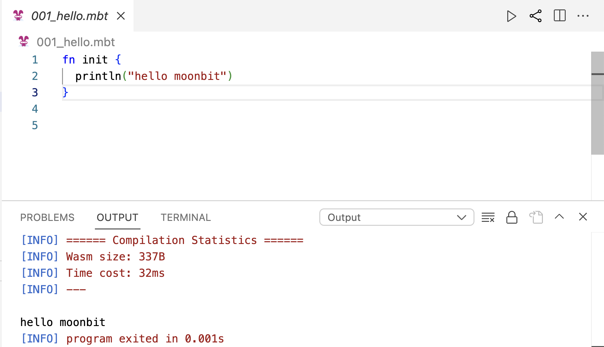
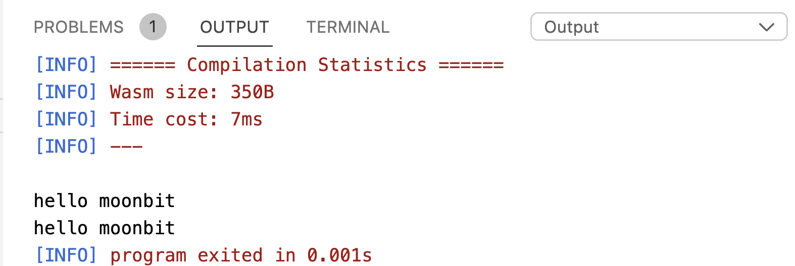
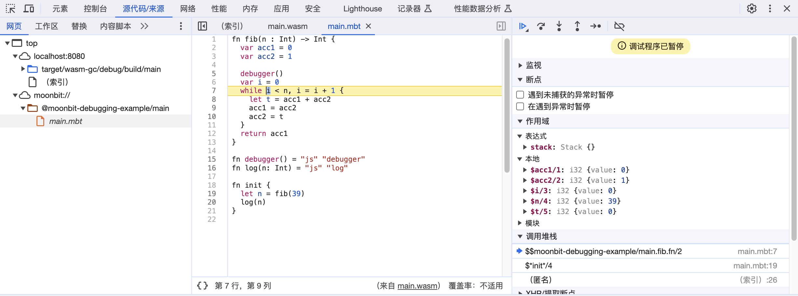

---
<!-- MoonBit Course © 2024 by DII, International Digital Economy Academy is licensed under Attribution-NonCommercial-NoDerivatives 4.0 International -->
marp: true
math: mathjax
paginate: true
backgroundImage: url('../pics/background_moonbit.webp')
headingDivider: 1
---

# 现代编程思想

## 命令式编程

### Hongbo Zhang

# 函数式编程

- 到此为止，我们介绍的可以归类于函数式编程的范畴
  - 对每一个输入，有着固定的输出
  - 对于标识符，我们可以直接用它所对应的值进行替代——引用透明性
- 开发实用的程序，我们需要一些计算之外的“副作用”
  - 进行输入输出
  - 修改内存中的数据等
  - 这些副作用可能导致多次执行的结果不一致

# 引用透明性

- 我们可以定义如下数据绑定和函数
```moonbit
let x: Int = 1 + 1
fn square(x: Int) -> Int { x * x }
let z: Int = square(x) // 4
```
- 我们可以将`square`与`x`直接用对应的值替换而不改变结果
```moonbit
let z: Int = { 2 * 2 } // 4
```
- 引用透明性可以易于理解

# 命令

- 函数`print`允许我们输出一个字符串，例如`print("hello moonbit")`
- 月兔中可以通过`init`代码块来定义初始化指令
  - 可以简单理解为程序主入口

```moonbit
fn init {
  println("hello moonbit") // 函数名中的ln代表换行
}
```



# 命令与副作用
- 输出命令可能会破坏引用透明性
```moonbit
fn square(x: Int) -> Int { x * x }
fn init { 
  let x: Int = { 
    println("hello moonbit") // <-- 我们首先执行命令，进行输出
    1 + 1 // <-- 之后，我们以表达式块最后的值作为表达式块的值
  }
  let z: Int = square(x) // 4, 输出一次
}
```


# 命令与副作用
- 我们不一定可以放心替换，因此会增大程序理解难度
```moonbit
fn init {
  let z: Int = { 
    println("hello moonbit"); // <-- 进行了第一次输出
    1 + 1 // <-- 获得值：2
  } * { 
    println("hello moonbit"); // <-- 进行了第二次输出
    1 + 1 // <-- 获得值：2
  } // 4，输出两次
} 
```



# 单值类型

- 我们之前已经介绍过单值类型`Unit`
  - 它仅有一个值：`()`
- 以`Unit`为运算结果类型的函数或命令一般有副作用
  - `fn print(String) -> Unit`
  - `fn println(String) -> Unit`
- 命令的类型也是单值类型
```moonbit
fn do_nothing() { // 返回值为单值类型时可以省略返回类型声明
  let _x = 0 // 结果为单值类型，符合函数定义
}
```

# 变量

- 在月兔中，我们可以在代码块中用`let mut`定义临时变量

```moonbit
let mut x = 1
x = 10 // 赋值操作是一个命令
```

- 在月兔中，结构体的字段默认不可变，我们也允许可变的字段，需要用`mut`标识
```moonbit
struct Ref[T] { mut val : T }

fn init {
  let ref: Ref[Int] = { val: 1 } // ref 本身只是一个数据绑定
  ref.val = 10 // 我们可以修改结构体的字段
  println(ref.val.to_string()) // 输出 10
}
```

# 变量

- 我们可以将带有可变字段的结构体看作是引用


# 别名

- 指向相同的可变数据结构的两个标识符可以看作是别名

```moonbit
fn alter(a: Ref[Int], b: Ref[Int]) {
  a.val = 10
  b.val = 20
}

fn init {
  let x: Ref[Int] = { val : 1 }
  alter(x, x)
  println(x.val.to_string()) // x.val的值将会被改变两次
}
```

# 别名

- 指向相同的可变数据结构的两个标识符可以看作是别名


- 可变变量需要小心处理

# 循环

- 利用变量，我们可以定义循环
```moonbit
<定义变量及初始值>
while <针对变量判断是否继续循环>, <对变量进行迭代> {
  <需要重复执行的命令>
}
```
- 例如，我们可以反复执行n次输出操作
```moonbit
let mut i = 0
while i < 2, i = i + 1 {
  println("Output")
} // 重复输出2次
```

# 循环

- 我们进入循环时
  - 判断是否满足继续循环的条件
  - 执行命令
  - 对变量进行迭代
  - 重复以上过程
- 例如

```moonbit
let mut i = 0 // <-- 此时 i 等于 0
while i < 2, i = i + 1 { // <-- 此处，我们判断 i < 2 是否为真
  println("Output") // <-- 0 < 2，因此继续执行，输出第一次
} // <-- 此时，我们执行i = i + 2
```

# 循环

- 我们进入循环时
  - 判断是否满足继续循环的条件
  - 执行命令
  - 对变量进行迭代
  - 重复以上过程
- 例如

```moonbit
// 此时 i 等于 1
while i < 2, i = i + 1 { // <-- 此处，我们判断 i < 2 是否为真
  println("Output") // <-- 1 < 2，因此继续执行，输出第二次
} // <-- 此时，我们执行i = i + 2
```

# 循环

- 我们进入循环时
  - 判断是否满足继续循环的条件
  - 执行命令
  - 对变量进行迭代
  - 重复以上过程
- 例如

```moonbit
// 此时 i 等于 2
while i < 2, i = i + 1 { // <-- 此处，我们判断 i < 2 是否为真，结果为假
} // <-- 跳过
// <-- 继续后续执行
```

# 调试器

- 月兔的调试器允许我们在运行中看到实时的运行数据，更好理解运行过程


# 循环与递归

- 事实上，循环与递归是等价的
```moonbit
let mut <变量> = <初始值>
while <判断是否继续循环>, <对变量进行迭代> {
  <需要重复执行的命令>
}
```
- 利用可变变量的情况下可以写成
```moonbit
fn loop_(<参数>) {
  if <判断是否继续循环> {
    <需要重复执行的命令>
    loop_(<迭代后的参数>)
  } else { () }
}
loop_(<初始值>)
```

# 循环与递归

- 例如下述两段代码执行效果相同
```moonbit
let mut i = 0
while i < 2, i = i + 1 {
  println("Hello!")
}
```

```moonbit
fn loop_(i: Int) {
  if i < 2 {
    println("Hello!")
    loop_(i + 1)
  } else { () }
}
loop_(0)
```

# 循环流的控制
- 循环的时候，可以提前中止循环，或是跳过后续命令的执行
  - `break`指令可以中止循环
  - `continue`指令可以跳过后续运行，直接进入下一次循环
```moonbit
fn print_first_3() {
  let mut i = 0
  while i < 10, i = i + 1 {
    if i == 3 {
      break // 跳过从3开始的情况
    } else {
      println(i.to_string())
    }
  }
}
```

# 循环流的控制
- 循环的时候，可以提前中止循环，或是跳过后续命令的执行
  - `break`指令可以中止循环
  - `continue`指令可以跳过后续运行，直接进入下一次循环
```moonbit
fn print_skip_3() {
  let mut i = 0
  while i < 10, i = i + 1 {
    if i == 3 {
      continue // 跳过3
    } else { () }
    println(i.to_string())
  }
}
```

# 月兔的检查

- 月兔会检查一个变量是否被修改，可以避免出现循环忘记加迭代条件

- 月兔也会检查函数返回结果是否与类型声明相同，可以避免错误的返回类型声明


# 可变数据

- 使用场景广泛
  - 直接操作程序外环境，如硬件等
  - 一些情况下性能更好，如随机访问数组等
  - 可以构建部分复杂数据结构，如图
  - 重复利用空间（原地修改）
- 可变数据并不总是与引用透明性冲突
```moonbit
fn fib_mut(n: Int) -> Int { // 对于相同输入，总是有相同输出
  let mut acc1 = 0; let mut acc2 = 1; let mut i = 0
  while i < n, i = i + 1 {
    let t = acc1 + acc2
    acc1 = acc2;  acc2 = t
  }
  acc1
}
```
# 总结

本章节初步接触了命令式编程，包括
  - 如何使用命令
  - 如何使用变量
  - 如何使用循环等
