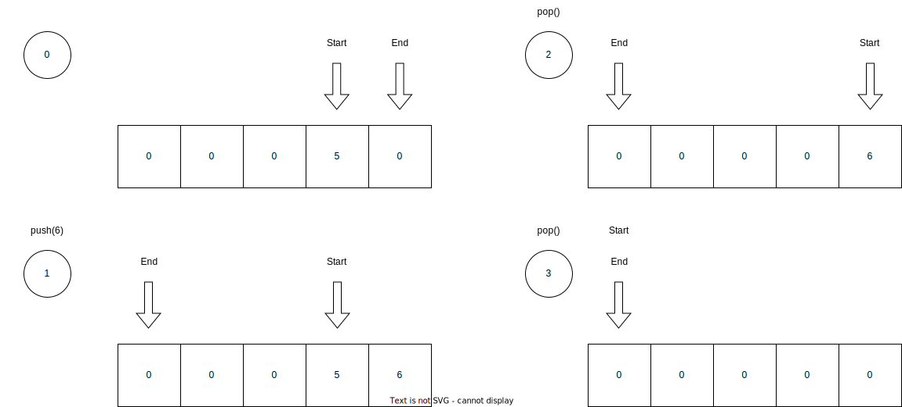
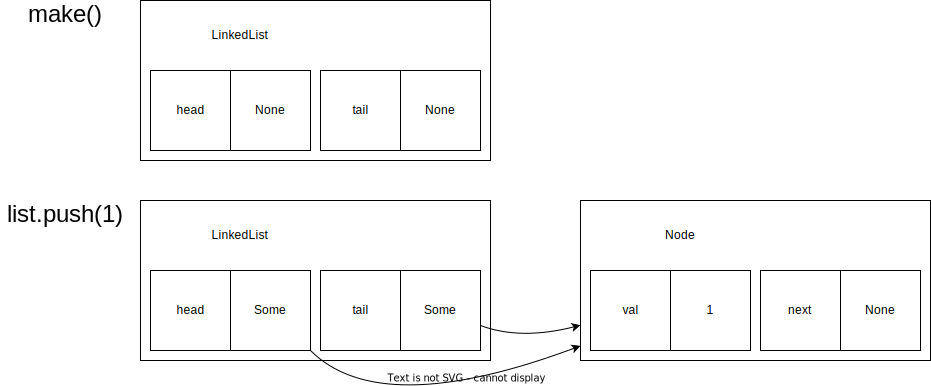
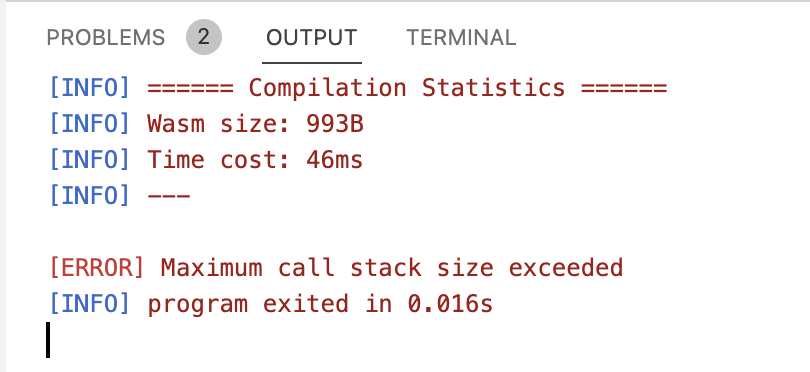

---
# MoonBit Course © 2024 by DII, International Digital Economy Academy is licensed under Attribution-NonCommercial-NoDerivatives 4.0 International
marp: true
math: mathjax
paginate: true
backgroundImage: url('../pics/background_moonbit.webp')
headingDivider: 1
---

# 现代编程思想

## 队列：可变数据结构实现

### Hongbo Zhang

# 队列

- 我们曾经介绍过队列这个数据结构
  - 先进先出
  - 利用两个堆栈进行实现
- 我们利用可变数据结构进行实现
  - 基于数组的循环队列
  - 单向链表

# 队列

- 我们实现以下函数（以整数队列为例）

```moonbit
struct Queue { .. }

fn make() -> Queue // 创建空列表
fn push(self: Queue, t: Int) -> Queue // 添加元素
fn pop(self: Queue) -> Queue // 删除元素
fn peek(self: Queue) -> Int // 查看当前头元素
fn length(self: Queue) -> Int // 查看列表长度
```

- 其中`push`与`pop`均将修改`self`，为了方便起见，我们将本身作为返回值传回
```moonbit
make().push(1).push(2).push(3).pop().pop().length() // 1
```

# 循环队列

- 我们可以利用一个数组来代表队列
  - 数组是一个连续的存储空间，每一个字段均可被修改
  - 数组被分配后长度不变

```moonbit
let a: Array[Int] = Array::make(5, 0)
a[0] = 1
a[1] = 2
println(a) // [1, 2, 0, 0, 0]
```
- 我们记录当前的开始和结束，每当添加新的元素的时候，结束向后移一位
  - 如果超出数组长度，则绕回开头

# 循环队列


# 循环队列




# 循环队列

- 一个简易实现
```moonbit
struct Queue {
  mut array: Array[Int]
  mut start: Int
  mut end: Int // end指向队尾的空格子
  mut length: Int
}

// 向队列中添加元素
fn push(self: Queue, t: Int) -> Queue {
  self.array[self.end] = t
  self.end = (self.end + 1) % self.array.length() // 超出队尾则转回队首
  self.length = self.length + 1
  self   
}
```

- 问题：如果元素数量超出了数组长度

# 循环队列

- 队列的扩容操作
  - 我们首先判断是否需要扩容
  - 我们创建新的更长的数组，并将原有数据进行复制

```moonbit
fn push(self: Queue, t: Int) -> Queue {
  if self.length == self.array.length() {
    let new_array: Array[Int] = Array::make(self.array.length() * 2, 0)
    let mut i = 0
    while i < self.array.length(), i = i + 1 {
      new_array[i] = self.array[(self.start + i) % self.array.length()]
    }
    self.start = 0
    self.end = self.array.length()
    self.array = new_array
    self.push(t)
  } else { .. }
}
```

# 循环队列

- 取出元素仅需移除`start`所指向的元素，并将`start`向后移
```moonbit
fn pop(self: Queue) -> Queue {
  self.array[self.start] = 0
  self.start = (self.start + 1) % self.array.length()
  self.length = self.length - 1
  self
}
```
- 列表长度一直被动态维护
```moonbit
fn length(self: Queue) -> Int {
  self.length
}
```

# 循环队列：泛型版本

- 我们希望存储不止整数
```moonbit
fn make[T]() -> Queue[T] {
  {
    array: Array::make(5, ???),
    start: 0, end: 0, length: 0
  }
}
```
- 默认值应该是什么？
  - `Option::None`
  - `T::default()`

# 单向链表

- 每个数据结构都指向下一个数据结构
  - 像锁链一样相连

```moonbit
struct Node[T] {
  val: T
  mut next: Option[Node[T]] // 指向下一个节点
}

struct LinkedList[T] {
  mut head: Option[Node[T]]
  mut tail: Option[Node[T]]
}
```

# 单向链表



# 单向链表


# 单向链表

- 当我们添加时，我们判断链表是否非空
  - 若非空，则向队尾添加，并维护链表关系

```moonbit
fn push[T](self: LinkedList[T], value: T) -> LinkedList[T] {
  let node = { value, next: None }
  match self.tail {
    None => {
      self.head = Some(node)
      self.tail = Some(node)
    }
    Some(n) => {
      n.next = Some(node)
      self.tail = Some(node)
    }
  }
  self
}
```

# 单向链表长度

- 我们写一个简单的判定长度的递归函数
  - 我们使用递归从头开始沿着引用链访问所有的节点
```moonbit
fn length[T](self: LinkedList[T]) -> Int {
  fn aux(node: Option[Node[T]]) -> Int {
    match node {
      None => 0
      Some(node) => 1 + aux(node.next)
    }
  }
  aux(self.head)
}
```

# 单向链表长度

- 当链表过长时，会观察到“栈溢出”的信息
```moonbit
fn init {
  let list = make()
  let mut i = 0
  while i < 100000, i = i + 1 {
    let _ = list.push(i)
  }
  println(list.length())
}  
```



# 函数调用栈

- 当我们调用函数时，我们进入一个新的计算环境
  - 新的环境定义了参数的绑定
  - 旧的环境被保留在堆栈上，在调用函数返回后继续进行运算
- 当我们调用链表长度函数，堆栈将会不断增高，直到超出内存限制
  - 如果我们能够让旧的环境无需被保留，则可以解决问题

# 尾调用

- 我们确保函数的最后一个运算是函数调用
  - 若为函数本身，则称为尾递归
- 函数调用的结果即最终的运算结果
  - 如此，我们无需保留当前运算环境
```moonbit
fn length[T](self: LinkedList[T]) -> Int {
  fn aux2(node: Option[Node[T]], cumul) -> Int {
    match node {
      None => cumul
      Some(node) => aux2(node.next, 1 + cumul)
    }
  }
  aux2(self.head, 0)
}
```

# 总结

- 本章节我们介绍了使用可变数据结构定义队列
  - 循环队列与单向链表的实现
  - 尾调用与尾递归
